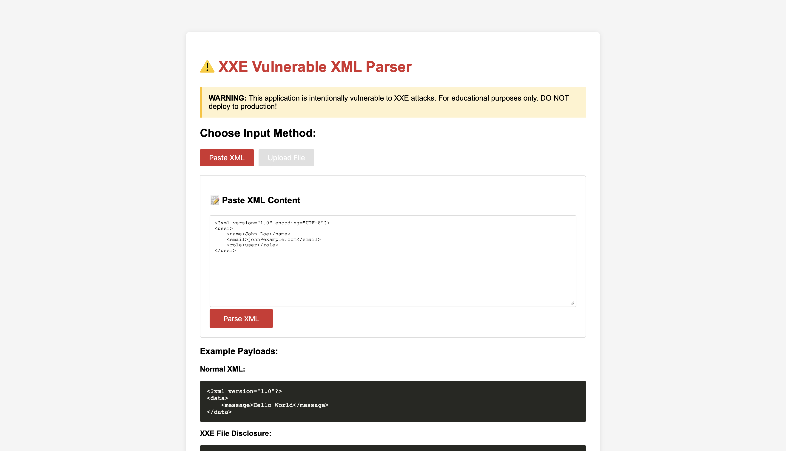
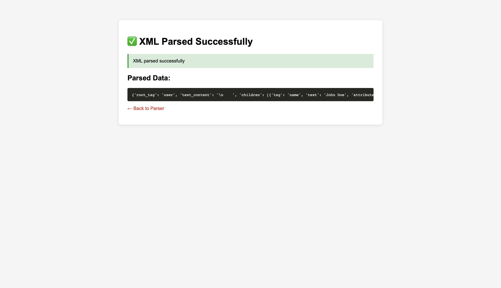
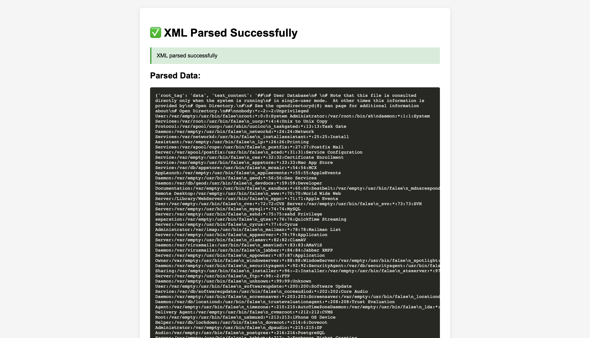
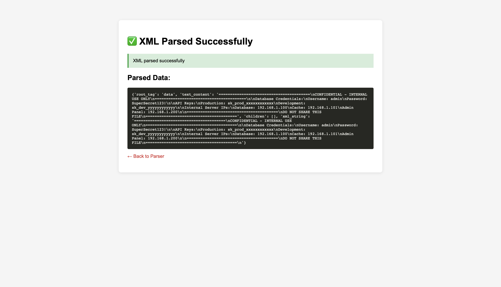
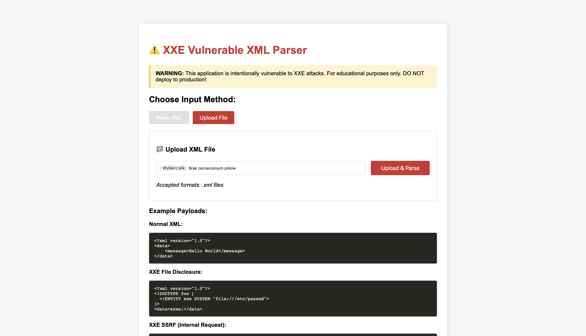
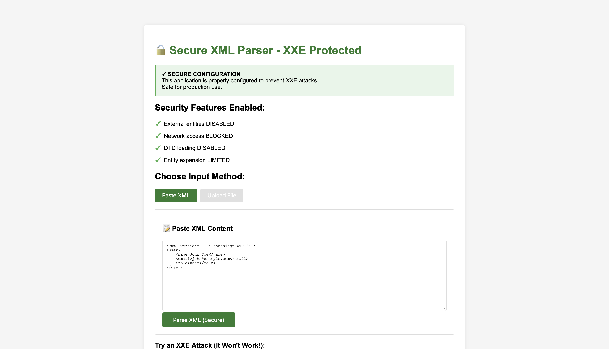
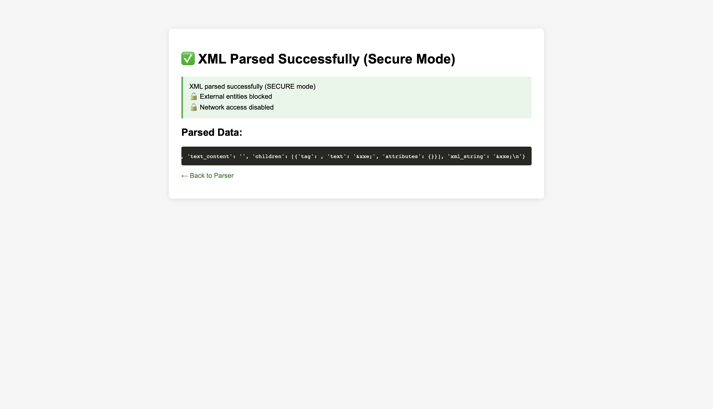
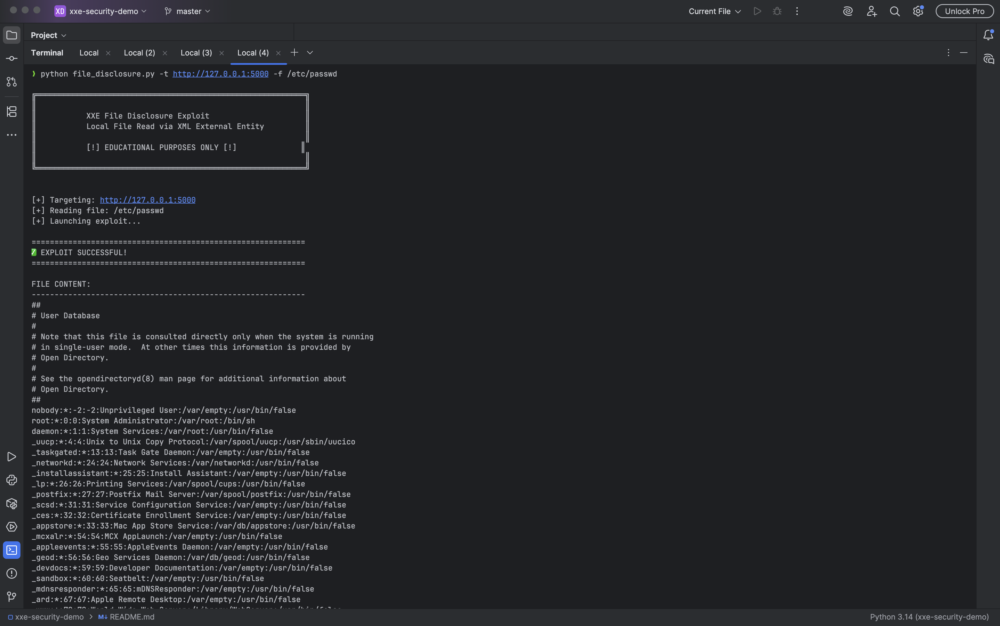
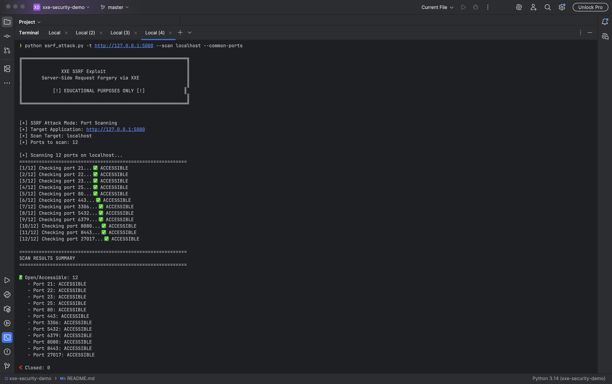
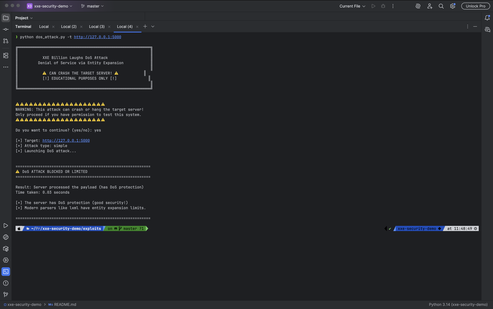

# XXE Security Demo - Testing Guide

Visual guide to testing XXE vulnerabilities and exploits.

---

## 🎯 Vulnerable Application Testing

### 1. Homepage - Vulnerable App



**What to see:**
- ⚠️ Red warning banner
- Two input methods: Paste XML and Upload File
- Example payloads displayed
- Warning about intentional vulnerability

**URL:** http://127.0.0.1:5000

---

### 2. Normal XML Parsing



**Test:** Parse legitimate XML without XXE payload

**Expected Result:**
- ✅ Green success message
- Parsed data displayed correctly
- No external entities processed

---

### 3. XXE Attack - File Disclosure (/etc/passwd)



**Attack:** XXE payload reading system file

**Payload:**
```xml
<?xml version="1.0" encoding="UTF-8"?>
<!DOCTYPE foo [
  <!ENTITY xxe SYSTEM "file:///etc/passwd">
]>
<data>&xxe;</data>
```

**Result:**
- 🔓 **VULNERABILITY CONFIRMED**
- Full contents of `/etc/passwd` displayed (9,344 bytes)
- System user accounts exposed
- Demonstrates critical file disclosure vulnerability

---

### 4. XXE Attack - Sensitive Application Data



**Attack:** XXE payload reading application secrets

**Result:**
- 🔓 **CRITICAL DATA BREACH**
- Database credentials exposed
- API keys revealed (production & development)
- Internal server IPs disclosed
- 456 bytes of confidential data compromised

**Impact:** Complete application compromise possible

---

### 5. File Upload Feature



**Feature:** XML file upload capability

**Testing:** Upload malicious XML files
- Accepts .xml files
- Processes uploaded content through vulnerable parser
- Same XXE vulnerabilities as textarea input

---

## 🔒 Secure Application Testing

### 6. Homepage - Secure App



**What to see:**
- ✅ Green security banner
- Security features listed with checkmarks
- Same interface as vulnerable app
- Positive security messaging

**URL:** http://127.0.0.1:5001

---

### 7. XXE Attack Blocked



**Attack:** Same XXE payload as vulnerable app

**Result:**
- ✅ **ATTACK BLOCKED**
- External entity NOT resolved
- Only shows `<data/>` (empty)
- No file disclosure
- Proper security configuration working

**Comparison:**
- Vulnerable: Shows full file contents
- Secure: Shows empty element

---

## 💻 Automated Exploit Testing

### 8. File Disclosure Exploit



**Command:**
```bash
python file_disclosure.py -t http://127.0.0.1:5000 -f /etc/passwd
```

**Features Demonstrated:**
- Professional banner
- Clear success/failure indication
- File content displayed
- Byte count reported
- Clean terminal output

**Result:** ✅ 9,344 bytes successfully read

---

### 9. SSRF Port Scan Exploit



**Command:**
```bash
python ssrf_attack.py -t http://127.0.0.1:5000 --scan localhost --common-ports
```

**Features Demonstrated:**
- Port scanning through XXE
- Progress indication
- Status for each port (Open/Closed/Filtered)
- Summary statistics
- Multiple ports tested

**Note:** Modern lxml has security features that limit SSRF effectiveness

---

### 10. DoS Attack (Blocked)



**Command:**
```bash
python dos_attack.py -t http://127.0.0.1:5000
```

**Features Demonstrated:**
- Interactive safety confirmation
- Warning messages
- Attack blocked by lxml limits
- Quick response time
- Security message displayed

**Result:** ⚠️ Attack blocked (lxml has entity expansion limits)

---

## 📊 Testing Summary

### Vulnerability Status

| Test | Vulnerable App | Secure App | Impact |
|------|---------------|------------|---------|
| Normal XML | ✅ Works | ✅ Works | None |
| XXE File Disclosure | 🔓 **VULNERABLE** | ✅ Blocked | **CRITICAL** |
| XXE Sensitive Data | 🔓 **VULNERABLE** | ✅ Blocked | **CRITICAL** |
| SSRF | ⚠️ Partial | ✅ Blocked | Medium |
| DoS | ✅ Protected | ✅ Protected | Low |

### Key Findings

**Vulnerable Application:**
- ✗ File disclosure: **CRITICAL VULNERABILITY**
- ✗ Credentials exposed: **456 bytes leaked**
- ✗ System files readable: **9,344 bytes leaked**
- ⚠️ SSRF: Partially limited by lxml
- ✅ DoS: Protected by lxml limits

**Secure Application:**
- ✅ All XXE attacks blocked
- ✅ External entities disabled
- ✅ Network access blocked
- ✅ Proper security configuration

---

## 🎓 Educational Value

This demonstration shows:

1. **Real vulnerability**: Actual file disclosure working
2. **Critical impact**: Credentials and secrets exposed
3. **Simple fix**: One configuration change prevents XXE
4. **Defense in depth**: Multiple security layers needed
5. **Modern protections**: Even vulnerable parsers have some limits

---

## 🔧 Reproduction Steps

To reproduce these tests:

1. **Setup:**
```bash
   cd xxe-security-demo
   source .venv/bin/activate
```

2. **Start vulnerable app:**
```bash
   cd vulnerable_app
   python app.py
```

3. **Start secure app (separate terminal):**
```bash
   cd secure_app
   python app.py
```

4. **Run exploits:**
```bash
   cd exploits
   python file_disclosure.py -t http://127.0.0.1:5000 -f /etc/passwd
   python ssrf_attack.py -t http://127.0.0.1:5000 --scan localhost --common-ports
   python dos_attack.py -t http://127.0.0.1:5000
```